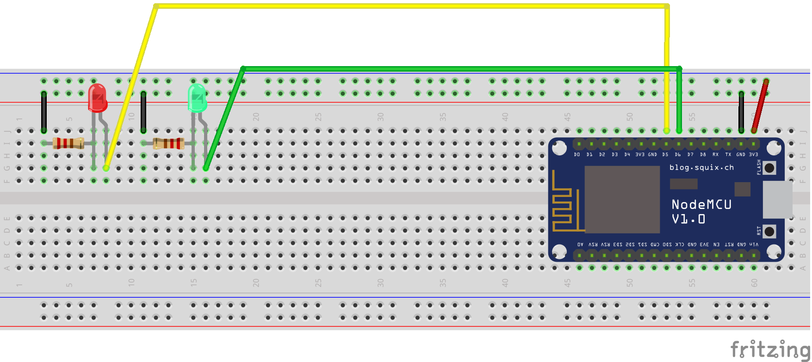
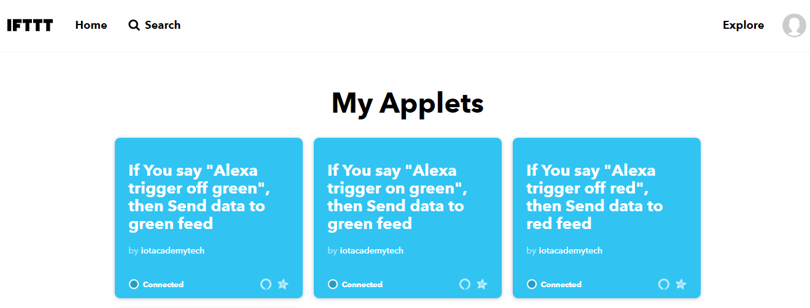
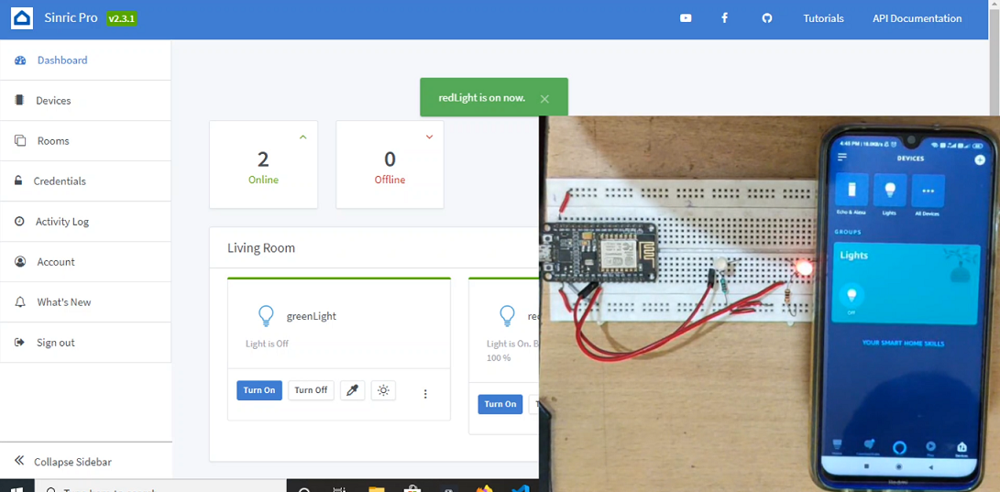

# Home Automation with Alexa

## YOUTUBE TUTORIAL LINKS

1. Setting up Adafruit.io and IFTTT for Alexa (PART 1):- 
2. Setting up Adafruit.io and IFTTT for Alexa (PART 2):- 

3. Setting up SINRIC & SINRIC.PRO for Alexa:- 
- PPT USED DURING THE SESSION:- alexa.pptx

## ARDUINO CODE WITH DESCRIPTION

1. adafruit_ifttt/adafruit_ifttt.ino -> Arduino code for connecting with Adafruit.io using Adafruit Mqtt library.

2. adafruit_ifttt2/adafruit_ifttt2.ino -> Arduino code for connecting with Adafruit.io using Arduino Mqtt library.

3. alexa_sinric/alexa_sinric.ino -> Arduino code for connecting with sinric.com (v1)

4. alexa_sinricpro/alexa_sinricpro.ino -> Arduino code for connecting with sinric.pro (v2)

## CIRCUIT DIAGRAM

## ADAFRUIT DASHBOARD WITH SETUP

## IFTTT APPLETS

## SINRICPRO DASHBOARD WITH SETUP

## LINK FOR WRITTEN BLOG

